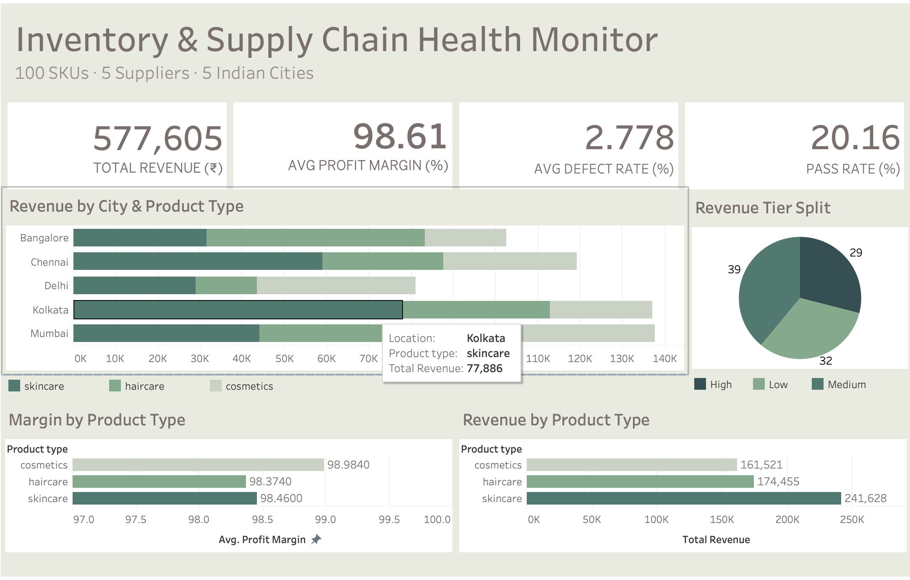
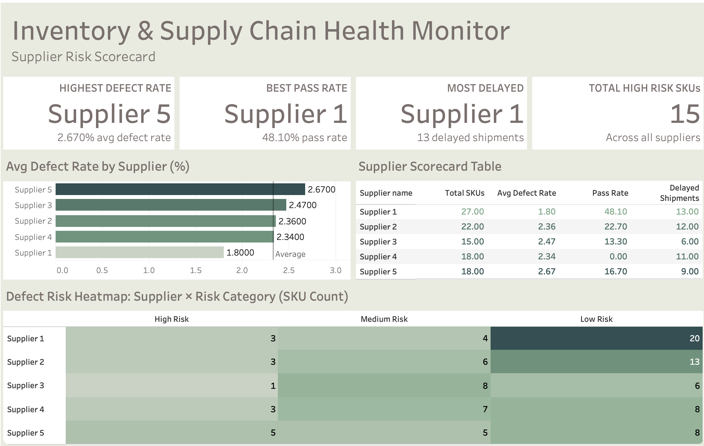
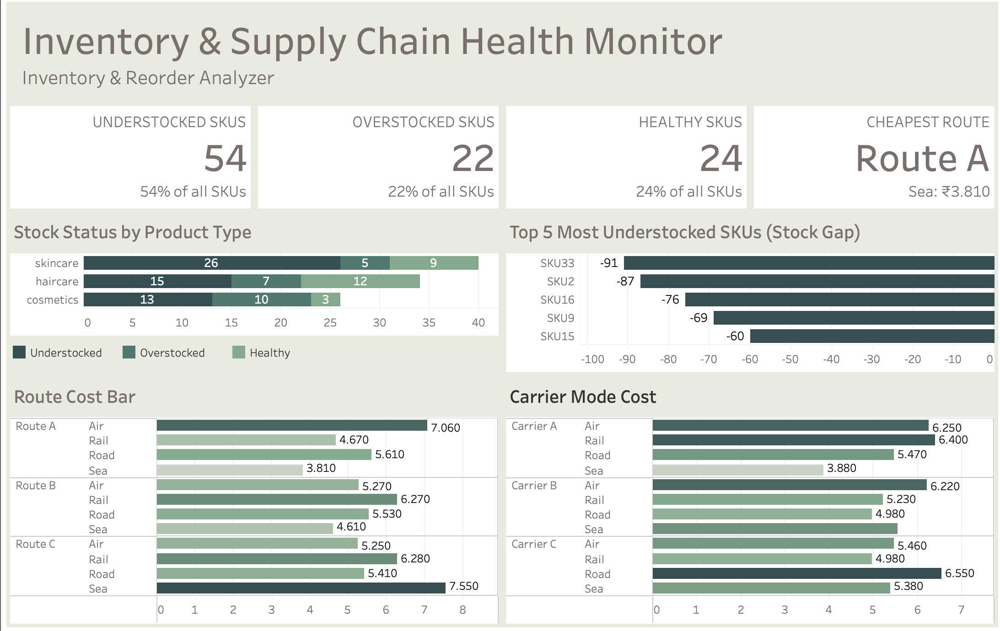

# 📦 Inventory & Supply Chain Health Monitor

An end-to-end supply chain analytics portfolio project built using **SQL (Azure Data Studio)**, **Docker**, and **Tableau Public**. The dashboard provides actionable visibility into inventory health, supplier risk, and logistics efficiency across 100 SKUs, 5 suppliers, and 5 Indian cities.

🔗 **[View Live Dashboard on Tableau Public](https://public.tableau.com/views/InventorySupplyChainHealthMonitoringStory/Story1?:language=en-US&:sid=&:redirect=auth&:display_count=n&:origin=viz_share_link)**

---

## 📌 Project Summary

This project simulates a real-world supply chain analytics use case for a beauty and personal care company operating across India. The goal was to identify inventory risks, evaluate supplier performance, and optimize logistics cost, delivered as an interactive 3-page Tableau dashboard backed by structured SQL analysis.

**Dataset:** [Supply Chain Dataset — Kaggle (Amir Motefaker)](https://www.kaggle.com/datasets/amirmotefaker/supply-chain-dataset/data)

---

## 🛠️ Tools & Technologies

| Tool | Purpose |
|---|---|
| **SQL Server (Docker)** | Local database environment via `mssql-dev` container |
| **Azure Data Studio** | SQL query development and execution |
| **Tableau Public Desktop** | Dashboard design and visualization |
| **Tableau Public (cloud)** | Dashboard hosting and portfolio sharing |
| **Docker** | Containerized SQL Server on Mac |
| **GitHub** | Project documentation and version control |

---

## 📁 Repository Structure

```
supply-chain-health-monitor/
│
├── data/
│   ├── 1_Inventory_Health.csv
│   ├── 2_Supplier_Performance_Scorecard.csv
│   ├── 2_Supplier_Performance_Scorecard_2.csv
│   ├── 3_Revenue_Profitability_1.csv
│   ├── 3_Revenue_Profitability_2.csv
│   ├── 4_Shipping_Logistics_1.csv
│   ├── 4_Shipping_Logistics_2.csv
│   ├── 5_Defect_Quality_Risk_1.csv
│   ├── 5_Defect_Quality_Risk_2.csv
│   └──supply_chain_clean.csv               ← raw dataset
├── screenshots/
│   └── (3 png files)
├── sql/
│   ├── 1_inventory_health.sql
│   ├── 2_supplier_performance.sql
│   ├── 3_revenue_profitability.sql
│   ├── 4_shipping_logistics.sql
│   └── 5_defect_quality_risk.sql
│
└── README.md
```

---

## 📊 Dashboard Pages

### Page 1 — Executive Overview

Provides a high-level summary of business performance across revenue, profitability, inventory health, and inspection quality.



**KPIs:**
| Metric | Value |
|---|---|
| Total Revenue | ₹577,605 |
| Avg Profit Margin | 98.61% |
| Avg Defect Rate | 2.778% |
| Inspection Pass Rate | 20.16% |

**Charts:**
- **Revenue by City & Product Type** — Grouped horizontal bar chart showing revenue contribution of Haircare, Skincare, and Cosmetics across Mumbai, Delhi, Kolkata, Bangalore, and Chennai
- **Revenue Tier Split** — Pie chart showing SKU distribution across High (29), Medium (39), and Low (32) revenue tiers
- **Margin by Product Type** — Horizontal bar chart comparing average profit margins across product categories
- **Revenue by Product Type** — Total revenue comparison: Skincare (₹241,628) leads, followed by Haircare (₹174,455) and Cosmetics (₹161,521)

**Key Insight:** Skincare drives 42% of total revenue, making it the highest priority category. All product types maintain near-identical profit margins (~98%), suggesting pricing is not a differentiator, but operational efficiency and inventory health are.

---

### Page 2 — Supplier Risk Scorecard

Evaluates all 5 suppliers across defect rates, inspection pass rates, and delivery delays to identify high-risk partners.



**KPIs:**
| Metric | Value |
|---|---|
| Highest Defect Rate | Supplier 5 (2.67%) |
| Best Inspection Pass Rate | Supplier 1 (48.1%) |
| Most Delayed Supplier | Supplier 1 (13 delayed shipments) |
| Total High Risk SKUs | 15 |

**Supplier Scorecard:**
| Supplier | Total SKUs | Avg Defect Rate | Pass Rate | Delayed Shipments |
|---|---|---|---|---|
| Supplier 1 | 27 | 1.80% | 48.10% | 13 |
| Supplier 2 | 22 | 2.36% | 22.70% | 12 |
| Supplier 3 | 15 | 2.47% | 13.30% | 6 |
| Supplier 4 | 18 | 2.34% | 0.00% | 11 |
| Supplier 5 | 18 | 2.67% | 16.70% | 9 |

**Charts:**
- **Avg Defect Rate by Supplier** — Horizontal bar chart with average benchmark reference line. Supplier 5 exceeds the benchmark most significantly
- **Supplier Scorecard Table** — Color-coded table with green highlighting for best performers and red for worst, across all KPIs
- **Defect Risk Heatmap (Supplier × Risk Category)** — Highlight table showing distribution of High, Medium, and Low risk SKUs per supplier

**Key Insights:**
- Supplier 4 has a 0% inspection pass rate, meaning zero SKUs passed quality inspection, flagging an urgent quality control failure
- Supplier 5 has the highest defect rate (2.67%) AND 5 high-risk SKUs, which is the most concerning supplier overall
- Supplier 1 has the best defect rate but the most delivery delays, which shows a reliability vs. quality trade-off that needs attention

---

### Page 3 — Inventory & Reorder Analyzer

Identifies stock health across product types, surfaces the most understocked SKUs, and compares shipping route and carrier costs.



**KPIs:**
| Metric | Value |
|---|---|
| Understocked SKUs | 54 (54% of all SKUs) |
| Overstocked SKUs | 22 (22% of all SKUs) |
| Healthy Stock | 24 (24% of all SKUs) |
| Cheapest Route | Route A · Sea · ₹3.81 avg cost |

**Charts:**
- **Stock Status by Product Type** — Stacked bar chart showing Understocked / Overstocked / Healthy SKU counts per product type. Skincare is most understocked (26 of 40 SKUs)
- **Top 5 Most Understocked SKUs** — Horizontal bar chart showing SKUs with the largest negative stock gap vs. order quantity. SKU33 has the worst gap (−91 units)
- **Route Cost Comparison** — Horizontal bar chart comparing average shipping cost per route and transportation mode combination. Route A Sea (₹3.81) is the cheapest; Route C Sea (₹7.55) most expensive
- **Carrier Mode Cost** — Horizontal bar chart comparing all carrier and transportation mode combinations. Carrier A Sea (₹3.88) is the most cost-efficient option

**Key Insights:**
- Only 24% of SKUs have healthy stock levels, showing a critical supply gap across the business
- SKU33, SKU2, and SKU16 are the most urgent reorder priorities with gaps of −91, −87, and −76 units, respectively
- Route A Sea is 98% cheaper than Route C for the same type of shipment, which gives us a significant cost savings opportunity if routes are optimized

---

## 🔍 SQL Analysis — Phase 1

Five structured SQL queries were written in Azure Data Studio and run against a SQL Server database containerized via Docker. Results were exported as CSVs and used as data sources in Tableau.

### Query 1 — Inventory Health by SKU & Product Type
Calculates stock gap (Stock Level − Order Quantity) and classifies each SKU as Understocked, Overstocked, or Healthy.

```sql
SELECT
    SKU, Product_type, Stock_levels, Order_quantities,
    (Stock_levels - Order_quantities) AS Stock_Gap,
    CASE
        WHEN Stock_levels < Order_quantities THEN 'Understocked'
        WHEN Stock_levels > Order_quantities * 2 THEN 'Overstocked'
        ELSE 'Healthy'
    END AS Stock_Status
FROM supply_chain
ORDER BY Stock_Gap ASC;
```

### Query 2 — Supplier Performance Scorecard
Aggregates defect rate, lead time deviation, inspection pass rate, and delayed shipments per supplier.

### Query 3 — Revenue & Profitability Breakdown
Summarizes revenue and profit margin by product type, location, and revenue tier.

### Query 4 — Shipping & Logistics Efficiency
Compares carrier and route combinations by average shipping cost and delivery time.

### Query 5 — Defect & Quality Risk Analysis
Identifies high-risk SKUs and defect risk distribution by supplier and product type.

---

## 🏭 Industrial Use Cases

This dashboard directly applies to the following real-world scenarios:

**1. Inventory Management**
Procurement and supply planning teams can use the understocked SKU list as a live reorder trigger. The stock gap metric enables priority-based purchasing decisions instead of reactive restocking.

**2. Supplier Quality Management**
Supplier scorecard data feeds directly into quarterly business reviews (QBRs) and vendor audit cycles. Suppliers with 0% pass rates (Supplier 4) would trigger corrective action plans or dual-sourcing strategies.

**3. Logistics Cost Optimization**
Operations and logistics teams can use route/carrier cost comparisons to renegotiate contracts or shift volume toward lower-cost routes. Moving from Route C Sea to Route A Sea could yield up to 50% shipping cost savings.

**4. Executive Reporting**
The Executive Overview page serves as a weekly operations review template, with summary KPIs with drill-down capability into supplier risk and inventory exposure.

**5. S&OP (Sales & Operations Planning)**
Revenue by city and product type feeds into demand planning cycles. The revenue tier split informs SKU rationalization decisions, which SKUs to prioritize, promote, or discontinue.

---

## 🚀 Future Scope

Most supply chain dashboards are built to report what has already happened. The next version of this project is designed to help managers act before problems escalate.

**1. Reorder Automation Triggers for Procurement Teams**
Right now, the understocked SKU list is a visual signal that requires a human to initiate a purchase order manually. The next iteration would connect stock gap thresholds directly to procurement workflows, so when a SKU's stock falls below its reorder point, a flagged alert is automatically routed to the responsible buyer. This removes the lag between insight and action, where most inventory failures occur.

**2. Supplier Scorecard as a Contractual Review Tool**
Supplier performance today lives in this dashboard as a snapshot. In a real operations environment, supply chain managers need this data to evolve into a rolling 90-day performance record that feeds directly into vendor contract reviews. Adding historical defect rate trends, on-time delivery percentages over time, and a composite supplier health score would give procurement leads the evidence they need to renegotiate terms, place corrective action requests, or qualify backup suppliers before a single-source risk becomes a supply disruption.

**3. Logistics Cost Benchmarking Across Time**
The route and carrier cost comparison in this dashboard is a one-time view. A more mature version would track cost per unit shipped for each route across quarters, allowing logistics managers to identify seasonal pricing patterns, benchmark against market rates, and build a data-backed case when negotiating carrier contracts. The difference between Route A Sea and Route C Sea is already nearly 100% in unit cost. Tracked over time, that gap either becomes a savings opportunity that gets captured or a cost overrun that goes unnoticed.

**4. Six Sigma DMAIC Integration**
This dashboard was built to answer the question of where supply chain performance is breaking down. A natural extension for quality-focused organizations is framing the entire analysis within a DMAIC (Define, Measure, Analyze, Improve, Control) structure. The supplier defect data and inspection pass rates already support a formal Measure and Analyze phase. Adding control charts, DPMO (Defects Per Million Opportunities) calculations, and a fishbone diagram for root cause analysis would make this a complete continuous improvement artifact, not just a reporting tool. For a Lean Six Sigma practitioner leading a supplier quality project, this dashboard becomes the "Improve" phase deliverable with a clear path to the "Control" phase.

---

## 📂 Data Source

**Dataset:** Supply Chain Dataset
**Author:** Amir Motefaker
**Source:** [Kaggle — Supply Chain Dataset](https://www.kaggle.com/datasets/amirmotefaker/supply-chain-dataset/data)

The dataset covers 100 SKUs across haircare, skincare, and cosmetics product categories. It includes supplier details, inventory levels, order quantities, shipping information, defect rates, and inspection results for 5 suppliers operating across 5 Indian cities.

---

## 👩‍💼 About This Project

Built as part of a supply chain analytics portfolio targeting operations analysis, supply chain analytics, and data analytics.

**Skills demonstrated:**
- SQL querying and data aggregation (GROUP BY, CASE WHEN, subqueries)
- Docker-based local database environment setup
- Tableau dashboard design across multiple pages with KPI cards, charts, heatmaps, and tables
- Supply chain domain knowledge: inventory management, supplier risk, logistics optimization
- Translating raw data into business-ready insights and executive narratives

---

*Built with SQL · Docker · Azure Data Studio · Tableau Public*
