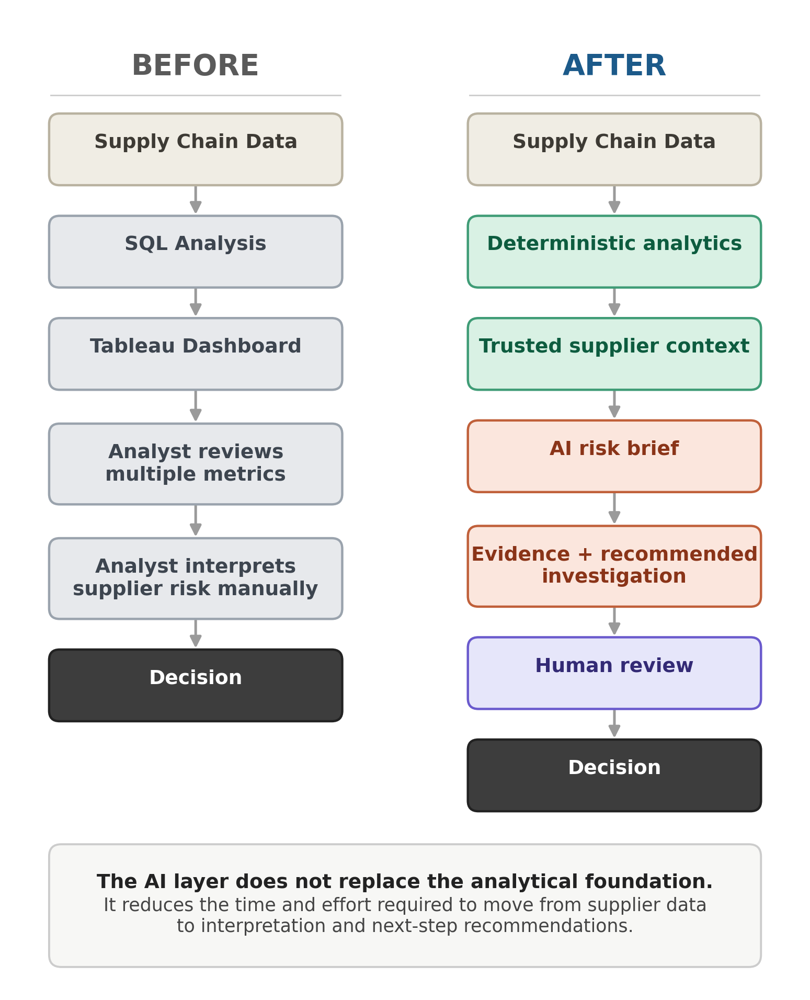

# 🤖 Supplier Intelligence Copilot
### Turning a Supply Chain Dashboard into an AI-Assisted Decision Partner

**Live Demo:** [supplier-intelligence-copilot.netlify.app](https://supplier-intelligence-copilot.netlify.app)

---

## 1. Where This Started

A while back I built a **Supply Chain Health Monitor** using SQL and Tableau. It tracked supplier performance, quality, lead times, and inventory health across 100 SKUs and 5 suppliers.

It was a good dashboard. It made the messy stuff visible: defect rates, inspection pass rates, high-risk SKUs, inventory imbalances, lead-time drift. All of it sitting there in charts and tables, waiting to be understood.

But visibility isn't the same as understanding. Every time someone opened that dashboard, they still had to do the real work themselves:

> "Okay, which supplier actually needs my attention right now, why, and what do I look into next?"

That question, the one no chart could answer on its own, became the seed for the next version of this project.

---

## 2. The Actual Problem

The dashboard was great at answering **"what is happening?"**

It was silent on **"what should I care about, why does it matter, and what do I do next?"**

So in practice, an analyst still had to:

1. Scroll through several metrics.
2. Mentally cross-reference quality, inventory, and delivery signals.
3. Decide, on gut feel, which numbers were actually alarming.
4. Separate the genuinely bad news from the noise.
5. Write up an explanation for whoever they reported to.
6. Figure out what to investigate next.

None of that is AI's job to "add" for the sake of it. The real goal was narrower and more useful: shrink the gap between **data, interpretation, and decision**.

---

## 3. Who This Is For

**Primary user:** a procurement or supply-chain analyst who monitors supplier performance and has to flag risk before it becomes a problem.

**Secondary user:** a supply-chain or procurement manager who reviews that risk and decides whether it's worth acting on.

**The job to be done, in plain words:**

> "When I check on my suppliers, I want to know fast which one needs my attention, why they're risky, and what I should look into, without having to stitch that story together myself from five different charts."

---

## 4. Where AI Actually Fit In

The real product question wasn't "how do I add AI to this." It was:

> "Which part of this workflow is AI actually good at improving?"

The existing analytics already calculated the important numbers reliably. Asking an LLM to re-derive defect rates or reinvent risk scores would have made the system *less* trustworthy, not more, just for the sake of looking fancy.

The better fit was using AI for the parts that are genuinely hard to automate with SQL:

- Synthesis
- Explanation
- Prioritization
- Evidence-based recommendations

Meanwhile, the business logic people actually rely on stays exactly what it was: deterministic, boring, and correct.

---

## 5. The Principles I Held Myself To

### 1. Don't use AI where deterministic logic already does the job better.
Supplier metrics and risk classification are calculated the same way every time. No reason to make that fuzzy.

### 2. Treat the LLM as an interpreter, not a source of truth.
It gets handed facts. It doesn't get to invent them.

### 3. Give the model only what it needs for the task at hand.
Less noise means it's much easier to catch when it says something it shouldn't.

### 4. Every important conclusion needs receipts.
If the model says a supplier is risky, it has to point to the exact metric that says so.

### 5. Design for the moments when data is missing.
The system should say "I don't have that" instead of quietly making something up.

### 6. Keep the decisions that actually matter in human hands.
AI can say "go look into this." A person decides what happens next.

---

## 6. Deciding What to Build First

I mapped out a few different directions this project could have gone.

| Idea | Impact on the User | Effort | Verdict |
|---|---|---|---|
| AI supplier risk brief | High | Low–Medium | Build first ✅ |
| Contract / policy search (RAG) | High | Medium–High | Later phase |
| Tool-using supplier investigator | High | High | Future phase |
| Fully autonomous supplier actions | High risk | Very High | Not for V1, maybe not ever |
| Full procurement platform | High | Very High | Out of scope |

The **AI supplier risk brief** won by a wide margin. It gave real value to the person using it without needing enterprise integrations or the risk that comes with letting AI take action on its own.

---

## 7. Defining the MVP

The smallest version worth building came down to one line:

> Pick a supplier → pull trusted metrics → calculate risk deterministically → generate an AI-written risk brief → human reviews it before anything happens.

Three questions had to be answered, in this order:

**What is this supplier's risk level right now?**
Answered by math, not the model.

**Why does this supplier deserve attention?**
Explained by the AI, using only evidence it was actually given.

**What should I look into next?**
Suggested by the AI, decided by the human.

---

## 8. Before and After



### Before, the analyst did all the heavy lifting

```text
Supply Chain Data
        ↓
SQL Analysis
        ↓
Tableau Dashboard
        ↓
Analyst reviews multiple metrics
        ↓
Analyst manually interprets supplier risk
        ↓
Decision
```

### After, the AI does the synthesis so the human can focus on judgment

```text
Supply Chain Data
        ↓
Deterministic Analytics
        ↓
Trusted Supplier Context
        ↓
AI Risk Brief
        ↓
Evidence + Recommended Investigation
        ↓
Human Review
        ↓
Decision
```

To be clear: the AI layer doesn't replace the analytics underneath it. It just closes the distance between "here's a bunch of numbers" and "here's what to actually do about them."

---

## 9. How the System Is Put Together


The whole design hinges on keeping three things separate: deterministic calculations, AI interpretation, and human decision-making. They don't get to blur into each other.

```text
Cleaned Supply Chain Data
            ↓
Deterministic Analytics
            ↓
Trusted Supplier Context
            ↓
Netlify Backend Function
            ↓
OpenAI API / LLM
            ↓
Structured Risk Brief
            ↓
Human Review & Decision
```

**Source of truth:** the cleaned dataset and the deterministic calculations. Full stop.

**The AI's boundary:** it interprets what it's given. It does not get to decide the "official" risk score.

**The human's boundary:** anything that actually costs money or affects a supplier relationship stays with a person.

---

## 10. What Never Touches the Model

These are calculated in code, before the AI ever sees anything:

- Supplier average defect rate
- Supplier risk classification
- Inspection pass rate
- High-risk SKU count and rate
- Average lead-time deviation
- Above-average lead-time SKU count
- Understocked SKU count
- Healthy SKU count
- Overstocked SKU count

Doing it this way means the AI is never on the hook for facts that software is already better at producing consistently.

---

## 11. The "Trusted Context" the Model Actually Sees

Instead of dumping the whole dataset on the LLM, the app builds a focused package of exactly what matters for judging one supplier's risk. Nothing more.

Here's what that looks like for Supplier 5:

```json
{
  "Supplier_name": "Supplier 5",
  "Aggregated_Supplier_Risk": {
    "Risk_Tier": "Medium Risk",
    "Avg_Defect_Rate_Pct": 2.67
  },
  "Quality": {
    "Pass_Rate_Pct": 16.7,
    "High_Risk_SKUs": 5,
    "Total_SKUs": 18,
    "High_Risk_SKU_Rate_Pct": 27.8
  },
  "Delivery": {
    "Avg_Lead_Time_Deviation": -1.28,
    "Lead_Time_Benchmark_Days": 16
  },
  "Inventory": {
    "Understocked_SKUs": 11,
    "Healthy_SKUs": 4,
    "Overstocked_SKUs": 3
  }
}
```

This is the fence around what the model is allowed to know and reason about. Nothing outside it is fair game.

---

## 12. What the AI Is Actually Responsible For

The AI's job is interpretation, not calculation. Specifically, it:

- Explains supplier risk in plain, human language
- Names the biggest risk drivers
- Backs each one up with real evidence
- Points out what's actually going well
- Recommends what to investigate or mitigate
- Flags when information is simply missing
- Wraps it all into a summary someone can act on

This is where the model earns its keep: doing the flexible, language-shaped work that a SQL query was never going to do well.

---

## 13. Keeping the Output Predictable

Rather than letting the model ramble, it returns a fixed JSON shape every time:

```json
{
  "risk_tier": "Medium Risk",
  "summary": "...",
  "top_risk_drivers": [
    {
      "driver": "...",
      "evidence": "..."
    }
  ],
  "healthy_signals": [
    {
      "signal": "...",
      "evidence": "..."
    }
  ],
  "recommended_actions": [
    "..."
  ],
  "data_limitations": [],
  "human_review_required": true
}
```

Structured output like this is what lets the front end render every brief the same way, no matter how the model phrases things internally.

---

## 14. Guardrails, or "Things the Model Is Not Allowed to Do"

The model is explicitly told to:

- Use only the trusted supplier context, nothing else
- Never invent supplier contracts
- Never invent demand information
- Never invent purchase-order details
- Never invent costs or supplier financials
- Never claim an SLA breach without actual SLA data
- Never override the deterministic risk score
- Cite evidence for every major risk driver it names
- Separate the good signals from the bad ones
- Say when information is missing instead of guessing
- Keep every recommendation advisory, never a directive
- Always require a human to review before anything moves forward

One guardrail turned out to matter more than I expected: **lead-time deviation**. A negative number there actually means the supplier is delivering *faster* than average, which is good. Without spelling that out explicitly, a model could easily read "negative" as "bad" and get the story backwards. So the context and instructions define exactly what that number means, no room for the model to guess wrong.

---

## 15. What Stays a Human Decision, Always

The Copilot will never:

- Terminate a supplier
- Auto-escalate a supplier
- Change sourcing allocation
- Issue a purchase order
- Modify a contract
- Negotiate terms
- Execute any procurement action

It can tell you what's worth digging into. It cannot decide what happens because of what it found. That line doesn't move.

---

## 16. A Real Example: Supplier 5

Supplier 5 is a good case study because the signals aren't all pointing the same direction, which is exactly the kind of nuance a dashboard alone tends to flatten out.

**What the numbers actually say:**

- Supplier risk: **Medium Risk**
- Average defect rate: **2.67%**
- Inspection pass rate: **16.7%**
- High-risk SKUs: **5 of 18**
- High-risk SKU rate: **27.8%**
- Average lead-time deviation: **-1.28 days** (faster than average, a good sign)
- Understocked SKUs: **11**
- Healthy SKUs: **4**
- Overstocked SKUs: **3**

The AI brief correctly calls out the quality and inventory concerns while also giving credit where it's due, that delivery timing is actually solid. That balance matters. A system that treats every metric as bad news isn't useful; it's just noisy in a new way.

---

## 17. How I'd Measure Success in Production

If this went from prototype to production, I'd track it across three lenses.

**User and business outcomes**
- Time to produce a decision-ready supplier risk brief
- How much effort it takes an analyst to spot real concerns
- Time from "reviewing a supplier" to "decided what to investigate"

**AI quality**
- Factual accuracy
- Rate of unsupported claims or hallucinations
- Whether the named risk drivers are actually relevant
- How well conclusions are grounded in evidence
- Structured-output validity and schema compliance
- How often a human has to correct it

**Adoption and trust**
- Repeat usage over time
- Percentage of briefs accepted without a factual correction
- Analyst satisfaction
- Percentage of recommendations people actually found useful

For now, these are the targets I'd design toward, not results I'm claiming to already have.

---

## 18. Why I Didn't Jump Straight to an Agent

It would have been tempting to build a fully autonomous agent right out of the gate. I didn't, on purpose.

The problem this project is solving didn't actually need dynamic multi-step reasoning or the model taking action on its own. Reaching for an agent anyway would have quietly added:

- Tool-selection risk
- Wrong arguments passed to tools
- New authorization requirements
- Retry and recovery logic
- Looping risk
- A much harder evaluation problem
- Bigger consequences the moment something goes wrong

Starting simple let me actually test whether the core idea worked before adding all of that complexity on top of an unproven hypothesis.

---

## 19. Where This Could Go Next

**V1, the version that exists today:** Deterministic analytics plus a structured AI-generated supplier risk brief.

**V2, a tool-using assistant:** Give the model approved tools it can call when it actually needs more information.

```text
get_supplier_metrics()
get_inventory_status()
get_high_risk_skus()
```

**V3, retrieval-augmented generation:** Pull in unstructured enterprise documents, things like supplier contracts, SLAs, quality reports, corrective-action reports, procurement policies, and historical scorecards, so recommendations can draw on evidence that doesn't exist in the structured dataset today.

**V4, agentic supplier investigation:** Someone types "investigate Supplier 5," and an agent decides which approved tools to call, gathers the relevant evidence, compares signals, recovers from failures on its own, and hands back a real investigation brief. A human still has to approve anything that actually happens as a result.

**V5, enterprise integration:** ERP integration, procurement APIs, real authentication, role-based access, approval workflows, audit logs, monitoring, evaluation pipelines, and live supplier data instead of a static dataset.

---

## 20. What This Isn't (Yet)

This is a portfolio prototype, not a production procurement system, and I want to be upfront about the gaps:

- Static supply-chain dataset
- Only five suppliers
- No live ERP integration
- No supplier-contract retrieval
- No live purchase-order data
- No enterprise authentication
- No enterprise role-based authorization
- A simplified supplier-risk methodology
- No production-scale AI evaluation yet

I'm listing these out on purpose. Each one would meaningfully change how a real enterprise version of this needs to be designed, and pretending otherwise wouldn't do anyone any favors.

---

## 21. What I Actually Took Away From This

The biggest lesson wasn't about prompting or APIs. It's that building a good AI feature mostly happens *before* you ever call the model.

The questions that actually mattered were things like:

- What problem genuinely needs AI, versus what just sounds impressive?
- What should stay deterministic no matter what?
- What's the actual source of truth here?
- What context does the model need, and what should it never see?
- What should the model be explicitly forbidden from guessing at?
- What happens the moment information is missing?
- Which actions require a human to sign off?
- How do I even know if the output is good?

This project started as a supply-chain dashboard. It turned into something closer to an exercise in AI product design, context engineering, system architecture, and thinking hard about where humans belong in the loop.

If I had to boil the whole thing down to one sentence, it'd be this:

> **Data provides facts. Deterministic logic establishes risk. AI explains and synthesizes. Humans decide.**

---

## 22. Tools & Technologies

**Analytics**
SQL · Excel · Tableau

**Application**
HTML · CSS · JavaScript

**AI**
OpenAI API · Structured Outputs · Context Engineering · Guardrails

**Deployment**
GitHub · Netlify · Netlify Serverless Functions

---

## 23. How I Actually Built This

This prototype came together through AI-assisted development. I wasn't trying to prove myself as a software engineer here, that wasn't the point.

What I was actually focused on:

- Figuring out the real user problem
- Defining a genuinely minimal MVP
- Designing the supplier-risk workflow end to end
- Deciding what business logic had to stay deterministic
- Designing the trusted context the model would see
- Defining exactly what the model was and wasn't responsible for
- Setting up guardrails
- Designing the structured output
- Drawing the line around human control
- Understanding how the whole system fit together
- Validating that the entire workflow actually worked, start to finish

The implementation was the easy part once those decisions were made. It just turned the product thinking into something that runs.

---

## 24. Where It Ended Up

This project started as:

> **A dashboard that shows supplier performance.**

And turned into:

> **A decision-support prototype that helps an analyst understand supplier risk, see the evidence behind it, and know what to look into next, all while keeping the business logic deterministic and the real decisions in human hands.**

**Live Demo:**
[supplier-intelligence-copilot.netlify.app](https://supplier-intelligence-copilot.netlify.app)
